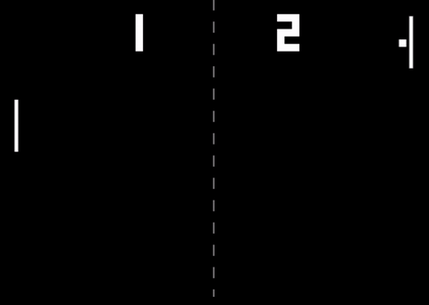

## Pong

[Pong live][pong]

[pong]: https://mrdsgc.github.io/Pong/

Pong is a classic two-player video game that involves bouncing a ball back and forth between two opposing sides. This project aims to recreate the retro feel and player experience of the original pong game.

## Features & Implementation

### Game logic

The game uses vanilla JavaScript and Canvas to render the `Player` and `Ball` objects on a canvas object. A `Point`object was created to determine positioning on the canvas and calculate collisions between the ball and different objects. Both the Winner and play again Dom elements were rendered conditionally from the game logic and allow for the user to reset the game.

Arrays of different y velocities for the ball creates variability in play:
```javascript
const variation = [0.85, 0.88, 0.91, 0.94, 0.97,
                   1.03, 1.06, 1.09, 1.12, 1.15]
if (this.ball.vel.y < 0 && this.ball.top() < 0 ||
    this.ball.vel.y > 0 && this.ball.bottom() > this.canvas.height) {
    this.ball.vel.y = -this.ball.vel.y * variation[Math.floor(Math.random()*variation.length)]
    if(!this.canvas.muted) {
      this.hitArraySounds[Math.floor(Math.random()*this.hitArraySounds.length)].play()
    }
}

```
Also, in the spirit of replicating the retro experience, the classic pong collision sounds were implemented into the game with a convenient mute button as well.

### Score rendering

In order to render the score dynamically on the play canvas, I used 15 character strings with `x`s and `os` to represent a 3x5 rectangle that would render out the pixelated digit. with each `x` representing a 10x10 white pixel on the canvas, i was able to create all 10 digits and render them out on the canvas conditionally from the players' scores.

Scores rendered out on canvas update on round reset:


### Computer difficulty

The Ai of the game uses a simple algorithm to follow the ball based of their respective y positions on the canvas. I wrote a conditional function that increased the difficulty of the Ai based on the player's score to increase the variability of play for player retention.

The computer increases in difficulty as the player scores more and slightly varies in speed to create variation in the game.
``` javascript
const compSpeed = [1.3, 1.4, 1.5, 1.55]
const compvariation = [0.94, 0.97, 1.03, 1.06]
let speed = 1
if (this.players[0].score > 8) {
  speed = compSpeed[3]
} else if (this.players[0].score > 6) {
  speed = compSpeed[2]
} else if (this.players[0].score > 4) {
  speed = compSpeed[1]
} else {
  speed = compSpeed[0]
}
if (this.players[1].pos.y < this.ball.pos.y) {
  this.players[1].pos.y+= speed *
  compvariation[Math.floor(Math.random()*compvariation.length)]
} else if (this.players[1].pos.y > this.ball.pos.y ) {
  this.players[1].pos.y-= speed *
  compvariation[Math.floor(Math.random()*compvariation.length)]
}
```
### Future Directions for the Project

While Pong itself may be a simpler game, many variations have been implemented over the years. I have some anticipated updates to implement into this game.

### Different Modes

I want to eventually incorporate different modes such as the popular breakout game into the game and eventually create a small retro library of games.

### Power ups

Many other renditions of pong have different perks such as increasing/decreasing paddle size, extra paddles, and curving ball trajectory to give variation to play. I want to eventually implement all of these features and more into this project.
